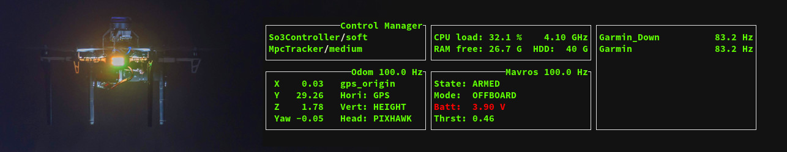

# MRS UAV Status [](https://travis-ci.com/ctu-mrs/mrs_uav_status)



## Real-time Terminal User Interface for monitoring and control

* Displays useful information about the UAV state and sensors
* Provides a basic control interface through which you can move the UAV, call ROS services and monitor your nodes
* Especially useful in real world UAV flights, but works as well in simulation
* Written in C++ with ncurses
* Runs on the UAV within its TMUX session
* Works through SSH on a flying UAV
* vim-like key bindings

### Controlling the UAV through MRS UAV Status
If the MRS UAV Status window is focused, you can use it to command the UAV. This works in simulation and with a real UAV through SSH.
 * press the 'R' key to enter the "remote" mode. While in this mode, you can fly the UAV with your keyboard:
   * use 'wsad' or 'hjkl' keys to fly laterally
   * use 'qe' keys to change the UAVs heading
   * use 'rf' keys to fly up and down
   * Only one key at a time is registered, multiple key inputs are not supported
   * To exit the remote mode, hit 'Esc'
 * Press the 'g' key (as go-to) to set references for the UAV
 * Press the 'm' key (as menu) to call services. You can add your own services to this menu.
   * To add a service to the menu, publish a message to the topic ```mrs_uav_status/set_trigger_service```
   * Only services of the [std_srvs/Trigger](http://docs.ros.org/melodic/api/std_srvs/html/srv/Trigger.html) type are supported
   * The message is a [std_msgs/String](http://docs.ros.org/melodic/api/std_msgs/html/msg/String.html), and has to consist of two entries separated by spaces:
     * Service name (```uav_manager/land_home```)
     * Name to be displayed in the menu (```Land Home```) - this name can contain additional spaces
   * The namespace of the UAV will be added automatically (```uav_manager/land_home``` -> ```/uav1/uav_manager/land_home```)
   * To a service outside of the namespace, use "/" as the first character (```/uav_manager/land_home```)
   
### Display custom messages from your nodes
If you need to monitor some aspect or behaviour of your node, you can display messages from said node in MRS UAV Status.
Simply publish a [std_msgs/String](http://docs.ros.org/melodic/api/std_msgs/html/msg/String.html) message to the topic ```mrs_uav_status/display_string```, and the message along with the publisher node name will show in MRS UAV Status.
 * Only the newest message from each node will be displayed
 * The message will be displayed for 10 seconds

### Monitoring ROS topic rates
MRS UAV Status can monitor rates of different ROS topics, and warn the user if the topic is published less frequently than required, or not published at all. There are two ways how to add monitored topics:

* Static tf
  * If a defined static tf is present, MRS UAV Status will monitor a coresponding topic.
  * This is intended to automatically monitor different sensor configurations.
  * To add more monitored static tfs, modify ```config/status.yaml``` file and add to the ```tf_static_list```
  * Each list member consists of 4 entries separated by spaces:
    * Name of the static tf (```garmin```)
    * Name of the topic to be monitored (```garmin/range```)
    * Name that will be displayed (```Garmin Down```) - this name can contain additional spaces
    * Desired rate of the topic (```50```)
* Any topic
  * If you need to monitor a topic which is not bound to a static tf
  * Add your topic to the want_hz list in ```config/status.yaml```
  * Each list member consists of 3 entries separated by spaces:
    * Name of the topic to be monitored (```bluefox/camera_info```)
    * Name that will be displayed (```Bluefox Optflow```) - this name can contain additional spaces
    * Desired rate of the topic (```50```)
    
* The namespace of the UAV will be added automatically to the tfs and topics (```garmin/range``` -> ```/uav1/garmin/range```)
* To monitor a tf/topic outside of the namespace, use "/" as the first character of the tf/topic_name (```/garmin/range```)
